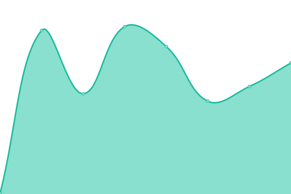
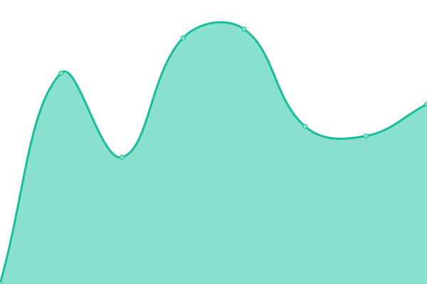

# [📈 Live Status](https://rouilj.github.io/RoundupAssets): <!--live status--> **🟩 All systems operational**

This repository contains the open-source uptime monitor and status page for [John P. Rouillard](https://www.cs.umb.edu/~rouilj/), powered by [Upptime](https://github.com/upptime/upptime).

With [Upptime](https://upptime.js.org), you can get your own unlimited and free uptime monitor and status page, powered entirely by a GitHub repository. We use [Issues](https://github.com/rouilj/RoundupAssets/issues) as incident reports, [Actions](https://github.com/rouilj/RoundupAssets/actions) as uptime monitors, and [Pages](https://rouilj.github.io/RoundupAssets) for the status page.

<!--start: status pages-->
<!-- This summary is generated by Upptime (https://github.com/upptime/upptime) -->
<!-- Do not edit this manually, your changes will be overwritten -->
<!-- prettier-ignore -->
| URL | Status | History | Response Time | Uptime |
| --- | ------ | ------- | ------------- | ------ |
|  [Main](https://www.roundup-tracker.org) | 🟩 Up | [main.yml](https://github.com/rouilj/RoundupAssets/commits/HEAD/history/main.yml) | 

 752ms
     
 | 

<a href="https://rouilj.github.io/RoundupAssets/history/main">100.00%</a>
    

|  [Tracker](https://issues.roundup-tracker.org/) | 🟩 Up | [tracker.yml](https://github.com/rouilj/RoundupAssets/commits/HEAD/history/tracker.yml) | 

 1145ms
     
 | 

<a href="https://rouilj.github.io/RoundupAssets/history/tracker">100.00%</a>
    

|  [Wiki](https://wiki.roundup-tracker.org) | 🟩 Up | [wiki.yml](https://github.com/rouilj/RoundupAssets/commits/HEAD/history/wiki.yml) | 

 939ms
     
 | 

<a href="https://rouilj.github.io/RoundupAssets/history/wiki">98.05%</a>
    

|  [Distribution (pypi)](https://pypi.org/project/roundup/) | 🟩 Up | [distribution-pypi.yml](https://github.com/rouilj/RoundupAssets/commits/HEAD/history/distribution-pypi.yml) | 

 54ms
     
 | 

<a href="https://rouilj.github.io/RoundupAssets/history/distribution-pypi">100.00%</a>
    

|  [Roundup-users mailing list](https://sourceforge.net/p/roundup/mailman/roundup-users/) | 🟩 Up | [roundup-users-mailing-list.yml](https://github.com/rouilj/RoundupAssets/commits/HEAD/history/roundup-users-mailing-list.yml) | 

 497ms
     
 | 

<a href="https://rouilj.github.io/RoundupAssets/history/roundup-users-mailing-list">100.00%</a>
    

|  [Fossil based IRC Log](https://rouilj.dynamic-dns.net/fossil/roundup_irc_logs/doc/trunk/log/roundup/) | 🟩 Up | [fossil-based-irc-log.yml](https://github.com/rouilj/RoundupAssets/commits/HEAD/history/fossil-based-irc-log.yml) | 

 513ms
     
 | 

<a href="https://rouilj.github.io/RoundupAssets/history/fossil-based-irc-log">94.04%</a>
    

|  [GitHub based IRC Log](https://github.com/rouilj/test) | 🟩 Up | [git-hub-based-irc-log.yml](https://github.com/rouilj/RoundupAssets/commits/HEAD/history/git-hub-based-irc-log.yml) | 

 374ms
     
 | 

<a href="https://rouilj.github.io/RoundupAssets/history/git-hub-based-irc-log">100.00%</a>
    

|  [Mercurial Repo (sourceforge)](https://sourceforge.net/p/roundup/code/ci/tip/tree/CHANGES.txt) | 🟩 Up | [mercurial-repo-sourceforge.yml](https://github.com/rouilj/RoundupAssets/commits/HEAD/history/mercurial-repo-sourceforge.yml) | 

 476ms
     
 | 

<a href="https://rouilj.github.io/RoundupAssets/history/mercurial-repo-sourceforge">100.00%</a>
    

|  [Unofficial Github Mirror](https://github.com/roundup-tracker/roundup) | 🟩 Up | [unofficial-github-mirror.yml](https://github.com/rouilj/RoundupAssets/commits/HEAD/history/unofficial-github-mirror.yml) | 

 364ms
     
 | 

<a href="https://rouilj.github.io/RoundupAssets/history/unofficial-github-mirror">100.00%</a>
    

|  [Travis CI](https://travis-ci.com/github/roundup-tracker/roundup) | 🟩 Up | [travis-ci.yml](https://github.com/rouilj/RoundupAssets/commits/HEAD/history/travis-ci.yml) | 

 474ms
     
 | 

<a href="https://rouilj.github.io/RoundupAssets/history/travis-ci">99.28%</a>
    

|  [CodeCov](https://app.codecov.io/gh/roundup-tracker/roundup/) | 🟩 Up | [code-cov.yml](https://github.com/rouilj/RoundupAssets/commits/HEAD/history/code-cov.yml) | 

 140ms
     
 | 

<a href="https://rouilj.github.io/RoundupAssets/history/code-cov">100.00%</a>
    

<!--end: status pages-->

[**Visit our status website →**](https://rouilj.github.io/RoundupAssets)

## 📄 License

- Powered by: [Upptime](https://github.com/upptime/upptime)
- Code: [MIT](./LICENSE) © [John P. Rouillard](https://www.cs.umb.edu/~rouilj/)
- Data in the `./history` directory: [Open Database License](https://opendatacommons.org/licenses/odbl/1-0/)
